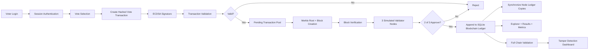

# Lightweight Multi-Node Blockchain Voting System with Digital Signatures, Validator-Based Consensus, Merkle Verification, and Tamper Detection

Academic research prototype for:

**“Lightweight Blockchain-Based Secure Voting System Using Efficient Transaction Validation and Simplified Block Verification”**

This is not a cryptocurrency, Bitcoin clone, Ethereum app, smart-contract system, or production election platform. It is a locally deployable Flask + SQLite research prototype focused on secure voting, lightweight blockchain validation, transparency, tamper resistance, and small-scale academic experimentation.

## Research Contributions

- ECDSA digital signatures for vote transaction authenticity.
- SHA-256 transaction hashing and block hashing.
- Voter privacy through hashed voter identity.
- Merkle root generation for efficient transaction verification.
- Full blockchain integrity validation with tamper detection.
- Simulated 3-node blockchain network.
- Lightweight validator-based consensus with 2-of-3 majority approval.
- No Proof of Work, mining, gas fees, Ethereum, Solidity, Ganache, MetaMask, or external blockchain APIs.
- Research metrics comparing validator consensus with a simulated Proof-of-Work baseline.

## Tech Stack

- Python 3
- Flask
- SQLite
- HTML, CSS, JavaScript
- Bootstrap
- `hashlib` SHA-256
- `cryptography` ECDSA signatures

## Project Structure

```text
Lightweight_Blockchain_Secure_Voting_System/
├── app.py
├── auth/
│   └── login.py
├── blockchain/
│   ├── block.py
│   ├── blockchain.py
│   ├── crypto_utils.py
│   ├── merkle.py
│   ├── transaction.py
│   └── validation.py
├── database/
│   └── db.py
├── nodes/
│   ├── network.py
│   ├── node_a/
│   ├── node_b/
│   └── node_c/
├── templates/
├── static/
├── requirements.txt
└── README.md
```

## Setup

```bash
cd Lightweight_Blockchain_Secure_Voting_System
pip install -r requirements.txt
python app.py
```

Open:

```text
http://127.0.0.1:5000
```

If port 5000 is busy:

```bash
PORT=5001 python app.py
```

The SQLite database is created automatically as `voting_system.db`.

## Sample Credentials

Admin:

```text
admin / admin123
```

Voters:

```text
VOTER001 / password123
VOTER002 / password123
VOTER003 / password123
```

## Upgraded Transaction Structure

```json
{
  "transaction_id": "uuid",
  "voter_hash": "sha256(voter_id)",
  "candidate": "candidate name",
  "timestamp": "UTC timestamp",
  "signature": "ECDSA signature over transaction_hash",
  "public_key": "voter public key PEM",
  "transaction_hash": "sha256(canonical payload)"
}
```

The private key is generated locally for each voter in this demo. The blockchain stores the voter hash and public key, not the voter’s plain identity.

## Upgraded Block Structure

```json
{
  "index": 1,
  "timestamp": "UTC timestamp",
  "transactions": [],
  "merkle_root": "root hash",
  "validator_votes": {
    "node_a": "approved",
    "node_b": "approved",
    "node_c": "approved"
  },
  "node_status": {},
  "previous_hash": "previous block hash",
  "nonce": 1,
  "current_hash": "block hash",
  "creation_time_ms": 0.0,
  "verification_time_ms": 0.0,
  "consensus_time_ms": 0.0
}
```

The nonce is deterministic metadata, not Proof of Work.

## Architecture Diagram



## Voting Methodology

1. Admin registers voters and candidates.
2. Each voter receives a local ECDSA key pair.
3. Voter logs in with a hashed password-backed account.
4. Vote is converted into a signed blockchain transaction.
5. Transaction validation checks:
   - voter exists
   - voter has not already voted
   - candidate exists
   - voter hash matches authenticated voter
   - public key matches registered voter key
   - transaction format is complete
   - transaction hash is correct
   - ECDSA signature is valid
6. Valid transaction enters the pending pool.
7. A lightweight block is created with a Merkle root.
8. Each simulated validator node independently verifies the block.
9. A 2-of-3 validator majority is required.
10. Accepted blocks are added to the main ledger and synchronized to node ledger copies.
11. Results are calculated directly from confirmed blockchain transactions.
12. `validate_chain()` continuously supports health monitoring and tamper detection.

## Full Chain Validation

`validate_chain()` verifies:

- previous hash linkage
- block ordering consistency
- block hash correctness
- transaction hash integrity
- ECDSA signature validity
- Merkle root correctness

It detects:

- modified transactions
- broken previous hashes
- invalid block hashes
- invalid signatures
- corrupted Merkle roots
- out-of-order blocks

## Lightweight Validator-Based Consensus

The system implements:

**“Lightweight Validator-Based Consensus for Secure Small-Scale Voting Systems.”**

Consensus model:

- 3 simulated validators: `node_a`, `node_b`, `node_c`
- each validator independently verifies the candidate block
- 2 approvals are required
- accepted blocks are synchronized to all node ledger copies

This avoids Proof of Work mining while still adding decentralized-style block acceptance for research demonstrations.

## Research Metrics

Dashboards display:

- transaction validation time
- signature verification time
- block creation time
- block verification time
- consensus approval time
- storage size
- average bytes per vote
- chain health status
- tamper detection errors
- simulated Proof-of-Work baseline time
- validator consensus speedup estimate

## Research Comparison

| Feature | Traditional Blockchain Voting | This Prototype |
|---|---|---|
| Consensus | Proof of Work, Proof of Stake, or smart contract execution | 2-of-3 lightweight validator approval |
| Computation | High for mining or contract execution | Low SHA-256, ECDSA verification, Merkle hashing |
| Deployment | Often needs Ethereum-like stack | Local Flask + SQLite |
| Storage | Can store heavy on-chain records | Minimal vote transaction data and voter hash |
| Identity | Often wallet or contract based | Registered voter + ECDSA key pair |
| Energy Use | High if mining is used | Very low |
| Verification | Distributed but complex | Simple full-chain validation and node simulation |
| Small Election Fit | Often overbuilt | Designed for academic small-scale deployments |

## API Documentation

### `POST /api/login`

```json
{
  "voter_id": "VOTER001",
  "password": "password123"
}
```

### `POST /api/logout`

Clears the session.

### `POST /api/register-voter`

Admin session required.

```json
{
  "voter_id": "VOTER004",
  "name": "New Voter",
  "password": "password123"
}
```

### `POST /api/cast-vote`

Voter session required. Creates, signs, validates, and submits a vote transaction.

```json
{
  "candidate": "Alice Sharma"
}
```

### `POST /api/validate-transaction`

Voter session required. Validates a supplied transaction.

### `POST /api/create-block`

Admin session required. Creates a block from pending transactions and runs validator consensus.

### `GET /api/blockchain`

Returns the blockchain ledger.

### `GET /api/results`

Returns vote totals calculated from the blockchain.

### `GET /api/chain/validate`

Returns full blockchain health status.

### `POST /api/tamper-demo`

Admin session required. Intentionally modifies the latest non-genesis block for research demonstration.

## Testing Guide

1. Run the app.
2. Log in as `VOTER001`.
3. Cast a vote.
4. Open `/blockchain`.
5. Confirm Merkle root, signatures, validator votes, and node status are visible.
6. Open `/results`.
7. Confirm the vote total is calculated from blockchain transactions.
8. Log in as admin.
9. Confirm `Blockchain Status: VALID`.
10. Click `Simulate Tampering`.
11. Confirm dashboard changes to `Blockchain Status: TAMPER DETECTED`.
12. Try voting again with the same voter and confirm duplicate prevention.

## Future Scope

The codebase is intentionally modular so future research extensions can be added:

- AI-based fraud detection
- biometric authentication
- peer-to-peer networking
- distributed deployment
- zero-knowledge proofs
- wallet-based identity
- threshold signatures
- privacy-preserving anonymous credentials

## Limitations

This remains an academic prototype. It does not provide production-grade election security, coercion resistance, anonymous credential issuance, independent election authority governance, hardware-backed key custody, or real distributed peer-to-peer networking.
