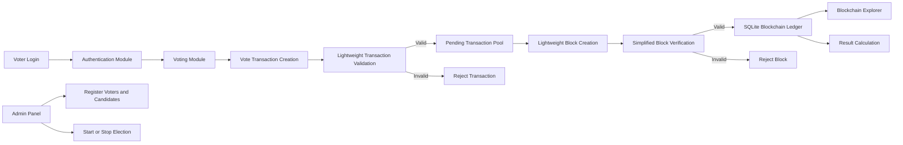
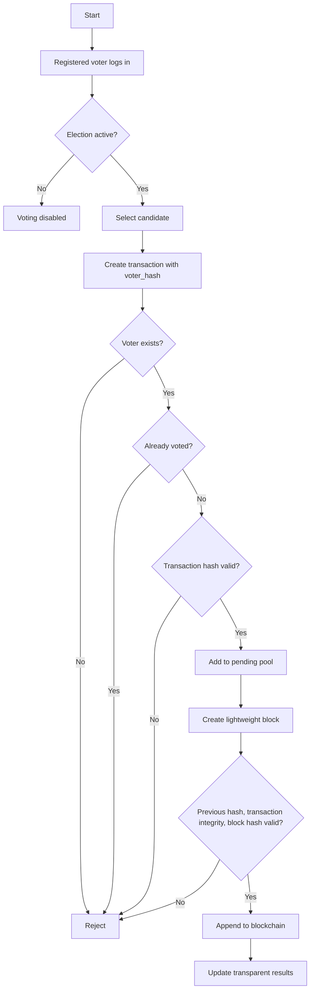

# Lightweight Blockchain-Based Secure Voting System Using Efficient Transaction Validation and Simplified Block Verification

This project is an academic research prototype for a private, lightweight blockchain-based electronic voting system. It is not a cryptocurrency, not a Bitcoin clone, and not a production election platform.

The prototype demonstrates how votes can be represented as validated blockchain transactions, grouped into tamper-resistant blocks, and counted transparently from an immutable ledger without Ethereum, Solidity, mining, Proof of Work, MetaMask, or external blockchain APIs.

## Research Focus

- Secure voting with registered voter authentication.
- Lightweight blockchain architecture for small deployments.
- Efficient transaction validation before ledger insertion.
- Simplified block verification using SHA-256 hash checks.
- Reduced storage overhead by storing voter hashes instead of voter identity.
- Local private deployment with SQLite and Flask.
- Transparent blockchain explorer and auditable results.

## Tech Stack

- Python 3
- Flask
- SQLite
- HTML, CSS, JavaScript
- Bootstrap
- Custom Python blockchain using `hashlib` SHA-256

## Project Structure

```text
Lightweight_Blockchain_Secure_Voting_System/
├── app.py
├── auth/
│   └── login.py
├── blockchain/
│   ├── block.py
│   ├── blockchain.py
│   ├── transaction.py
│   └── validation.py
├── database/
│   └── db.py
├── templates/
│   ├── admin.html
│   ├── admin_login.html
│   ├── base.html
│   ├── blockchain.html
│   ├── login.html
│   ├── results.html
│   └── vote.html
├── static/
│   ├── css/style.css
│   └── js/main.js
├── requirements.txt
└── README.md
```

## Setup Guide

```bash
cd Lightweight_Blockchain_Secure_Voting_System
pip install -r requirements.txt
python app.py
```

Open:

```text
http://127.0.0.1:5000
```

The SQLite database is initialized automatically as `voting_system.db`.

## Sample Credentials

Admin:

```text
Username: admin
Password: admin123
```

Sample voters:

```text
VOTER001 / password123
VOTER002 / password123
VOTER003 / password123
```

Sample candidates are inserted automatically:

```text
Alice Sharma
Bharat Mehta
Catherine D'Souza
```

## Architecture Diagram



## Voting Flowchart



## Methodology

1. Voter registration stores a unique `voter_id`, name, password hash, and voting status.
2. Authentication uses Flask sessions and Werkzeug password hashing.
3. A vote is converted into a transaction:

```json
{
  "transaction_id": "uuid",
  "voter_hash": "sha256(voter_id)",
  "candidate": "candidate name",
  "timestamp": "UTC timestamp",
  "transaction_hash": "sha256(canonical transaction payload)"
}
```

4. Transaction validation checks voter existence, duplicate voting status, candidate validity, transaction structure, and transaction hash integrity.
5. Valid transactions enter a pending pool and are written to the `transactions` table.
6. Blocks are created using deterministic SHA-256 hashing without Proof of Work.
7. Block verification checks previous hash correctness, all transaction hashes, and the block hash.
8. Valid blocks are appended to the SQLite-backed blockchain ledger.
9. Results are calculated directly from confirmed blockchain transactions.

## Lightweight Design Contribution

Traditional blockchain voting prototypes often inherit heavy cryptocurrency concepts: mining, gas fees, smart contracts, distributed consensus, and large storage demands. This system removes those costs for small private deployments.

The contribution is the combination of:

- Pre-ledger vote transaction validation.
- Voter privacy through hashed voter identity.
- Duplicate prevention using database status before transaction acceptance.
- Immediate block hash verification instead of Proof of Work.
- Minimal block fields stored in SQLite.
- Transparent result calculation from the blockchain ledger.

## Database Schema

### voters

- `voter_id`
- `name`
- `password_hash`
- `has_voted`
- `created_at`

### candidates

- `id`
- `name`

### blockchain

- `block_index`
- `timestamp`
- `transactions`
- `previous_hash`
- `nonce`
- `current_hash`
- `creation_time_ms`
- `verification_time_ms`

### transactions

- `transaction_id`
- `voter_hash`
- `candidate`
- `timestamp`
- `transaction_hash`
- `status`
- `validation_time_ms`
- `block_index`

### election_status

- `id`
- `is_active`

## API Documentation

### `POST /api/login`

```json
{
  "voter_id": "VOTER001",
  "password": "password123"
}
```

### `POST /api/logout`

Logs out the current user.

### `POST /api/register-voter`

Admin session required.

```json
{
  "voter_id": "VOTER004",
  "name": "New Voter",
  "password": "password123"
}
```

### `POST /api/cast-vote`

Voter session required.

```json
{
  "candidate": "Alice Sharma"
}
```

### `POST /api/validate-transaction`

Voter session required. Validates a supplied transaction object against the authenticated voter.

### `POST /api/create-block`

Admin session required. Creates a block from pending validated transactions.

### `GET /api/blockchain`

Returns all blocks.

### `GET /api/results`

Returns vote totals calculated from the blockchain.

## Research Metrics

The admin and results dashboards show:

- Average transaction validation time.
- Average block creation time.
- Average block verification time.
- Number of confirmed transactions.
- Chain storage size in bytes.
- Average bytes per vote.
- Duplicate vote prevention status.

These metrics can be used in a research paper to compare the prototype against heavier smart-contract or Proof-of-Work-based voting systems.

## Testing Guide

1. Start the Flask app.
2. Log in as `VOTER001`.
3. Cast a vote.
4. Open the blockchain explorer and confirm that a new block appears.
5. Open results and verify that the vote total changed.
6. Log out, log in again as `VOTER001`, and try to vote again.
7. Confirm duplicate vote rejection.
8. Log in as admin and add a voter or candidate.
9. Stop the election and confirm voters cannot cast new votes.

## Important Limitations

This project is intentionally scoped as a research prototype. It does not implement national-scale election security, distributed authority management, hardware-backed identity, coercion resistance, anonymous credential protocols, or production-grade election auditing.

## Screenshots

Run the project and visit:

- `/login`
- `/vote`
- `/admin`
- `/blockchain`
- `/results`

These pages provide the requested UI screens for project reports and screenshots.
